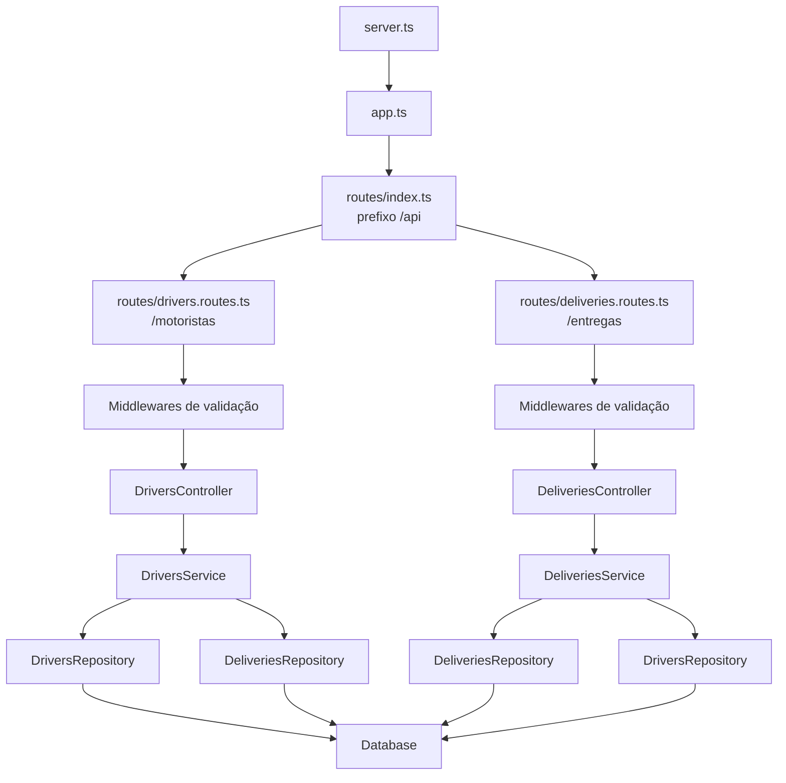

# Delivery Tracker API

Aplicação backend para rastrear o ciclo de vida de encomendas de uma empresa de logística.

Desenvolvida em express.js e Typescript.

## Scripts

`npm start`: compila a aplicação para JS e roda o servidor.

`npm run dev`: roda o servidor da aplicação TS e atualiza com alterações no código.

`npm run build`: compila a aplicação para JS.

`npm run lint`: executa o eslint, verificando erros de tipo e codigo invalido.

`npm run check`: testa o contrato da API (servidor precisa estar rodando).

## Rotas

### Motoristas

| Método | Endpoint                       | Descrição                      | Entrada                                                             |
| ------ | ------------------------------ | ------------------------------ | ------------------------------------------------------------------- |
| `POST` | `/api/motoristas`              | Cadastra um motorista          | `body = { "nome": string, "cpf": string, "placaVeiculo"?: string }` |
| `GET`  | `/api/motoristas`              | Lista todos os motoristas      | —                                                                   |
| `GET`  | `/api/motoristas/:id`          | Consulta um motorista          | —                                                                   |
| `GET`  | `/api/motoristas/:id/entregas` | Lista as entregas do motorista | `query ?= ?status=DeliveryStatus`                                   |

### Entregas

| Método  | Endpoint                      | Descrição                       | Entrada                                                               |
| ------- | ----------------------------- | ------------------------------- | --------------------------------------------------------------------- |
| `POST`  | `/api/entregas`               | Cadastra uma entrega            | `body = { "descricao": string, "origem": string, "destino": string }` |
| `GET`   | `/api/entregas`               | Lista as entregas               | `query ?= ?status=DeliveryStatus`                                     |
| `GET`   | `/api/entregas/:id`           | Consulta uma entrega            | —                                                                     |
| `PATCH` | `/api/entregas/:id/avancar`   | Avança o status da entrega      | —                                                                     |
| `PATCH` | `/api/entregas/:id/cancelar`  | Cancela uma entrega             | —                                                                     |
| `GET`   | `/api/entregas/:id/historico` | Consulta o histórico da entrega | —                                                                     |
| `PATCH` | `/api/entregas/:id/atribuir`  | Atribui um motorista à entrega  | `body = { "motoristaId": number }`                                    |

### Composição das dependências

O ponto de composição fica nos módulos de rota. Cada router instancia suas dependências concretas, injeta os repositories nos services e o service no controller. Os middlewares de validação são executados antes dos controllers nas rotas que exigem validação.

Os services dependem dos contratos `IDriversRepository` e `IDeliveriesRepository`, o que permite substituir os repositories concretos por mocks nos testes. A persistência atual é simulada em memória por `Database`.
